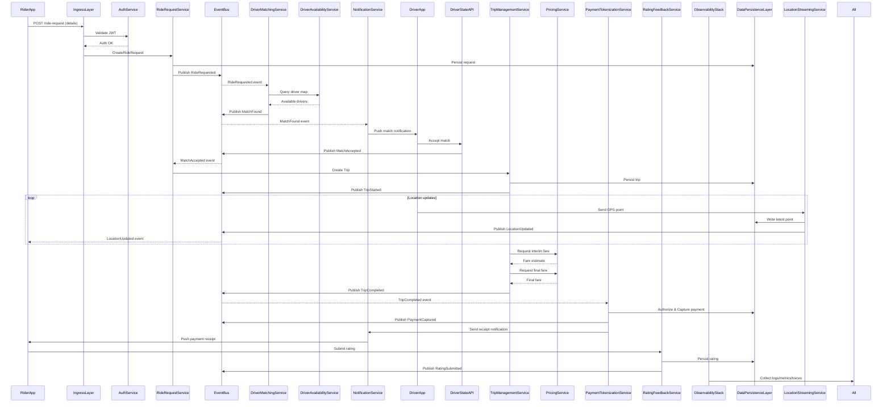

# System Design: Design: Build a Ride sharing backend 
> **Generated by Systemly** • v1.0 • February 3, 2026

---

| Project Metadata | Detail |
| :--- | :--- |
| **Project ID** | `cml1x1qy200012yhziv5cqcmb` |
| **Status** | `COMPLETED` |
| **Base Prompt** | *Build a Ride sharing backend 

[User Clarifications]
Q: What core features should the ride‑sharing b...* |


---

## Table of Contents
1. [Executive Summary](#1-executive-summary)
2. [Requirements & Constraints](#2-requirements--constraints)
3. [System Architecture](#3-system-architecture)
4. [Visualizations](#4-visualizations)
5. [Technology Stack](#5-technology-stack-selection)
6. [API Design Spec](#6-api-design-spec)
7. [Cost & Infrastructure](#7-cost--infrastructure-projection)
8. [Deployment Strategy](#8-deployment--cicd-strategy)
9. [Reliability & Failure Modes](#9-reliability--failure-modes)

---

## 1. Executive Summary
Build a Ride sharing backend 

---

## 2. Requirements & Constraints

### 🎯 Functional Requirements
- [ ] Rider can create a ride request specifying pickup, drop‑off, and optional preferences via a RESTful API.
- [ ] System performs driver matching within 0.5 ms of receiving a ride request, selecting the optimal driver based on proximity, availability, and rating.
- [ ] Driver can accept or reject a matched ride request through an API; acceptance finalizes the trip assignment.
- [ ] Trip lifecycle APIs to start, update (e.g., status changes, fare adjustments), and complete a trip, with real‑time location updates streamed at ≤0.5 ms processing latency per update.
- [ ] Real‑time location service ingests driver GPS points and makes the latest location available to riders and dispatch via a low‑latency publish/subscribe mechanism.
- [ ] Payment initiation API that creates a Stripe token for the rider’s payment method, authorizes the fare, and captures payment upon trip completion.
- [ ] Refund and dispute handling APIs that interact with Stripe’s tokenized payment data, complying with PCI‑DSS tokenization scope.
- [ ] Post‑trip rating API allowing rider and driver to submit a 1‑5 star rating and optional comments.
- [ ] OAuth2‑based authentication for riders, drivers, and admin users, issuing signed JWTs for subsequent API calls.
- [ ] Admin APIs for managing users, drivers, pricing rules (including surge pricing), and viewing audit logs.
- [ ] Fare calculation service that computes estimated and final fares based on distance, time, surge multiplier, and applicable discounts.
- [ ] Cancellation API for riders and drivers with appropriate fee handling.
- [ ] Notification service (push/email/SMS) to inform riders and drivers of request status, driver arrival, trip start/end, and payment receipts.

### ⚖️ Non-Functional Requirements
- [x] Latency: Ride‑request matching and each location update must be processed within 0.5 ms of receipt (backend processing time only; network latency excluded).
- [x] Throughput: System must sustain at least 2,000 requests per second sustained load and burst to 3,000 rps without degradation.
- [x] Concurrency: Support up to 10,000 concurrent active rides with associated state tracking.
- [x] Availability: 99.0% monthly uptime for the overall service and for each critical component (matching, trip tracking, payments).
- [x] Scalability: Automatic horizontal scaling of compute, database, and messaging layers to meet load targets.
- [x] Data Residency: All primary data stored in AWS Singapore (ap‑southeast‑1) region; no cross‑region replication.
- [x] PCI‑DSS Compliance: Store only payment tokens; no raw card data; all payment flows must use Stripe’s tokenization APIs; maintain audit logs for payment events.
- [x] Security: TLS 1.2+ for all in‑transit traffic; AES‑256 encryption at rest for all databases and S3 buckets; IAM least‑privilege policies; JWTs signed with rotating RSA keys.
- [x] Observability: Centralized logging (e.g., CloudWatch Logs), metrics (e.g., latency, error rates), and distributed tracing (e.g., X‑Ray) with alerts on SLA breaches.
- [x] Rate Limiting: Enforce per‑user and per‑IP request caps to protect against abuse (e.g., 20 rps per user).
- [x] Data Retention: Trip logs, driver/rider location histories, and payment transaction records retained for 1 month, then archived to S3 Glacier with lifecycle deletion after 12 months.
- [x] Disaster Recovery: Daily snapshots of databases retained for 7 days; ability to restore within 4 hours.
- [x] Cost Awareness: Use serverless or managed services where appropriate to keep monthly operational cost under a predefined budget (to be defined by finance).

### 💡 Core Assumptions
- 0.5 ms latency target refers to internal processing time; client‑to‑server network latency is not included.
- Peak load of 2,000 rps corresponds to the highest expected combined rate of ride‑request submissions, driver responses, and location updates.
- Stripe is the sole payment processor; the backend never stores raw card data, only Stripe tokens.
- All mobile clients (iOS/Android) have reliable internet connectivity; fallback to push notifications for intermittent connectivity.
- AWS services used will be those native to the Singapore region (e.g., ECS/EKS, DynamoDB, Aurora, S3, Kinesis, API Gateway, Cognito).
- Industry‑standard data retention for trip logs and location histories is 1 month, as explicitly provided.
- The “yes” responses to ambiguous SLA questions are interpreted as 99.0% availability for all components and that the latency target is end‑to‑end client‑to‑server processing budget of 0.5 ms.
- No regulatory requirements beyond PCI‑DSS tokenization and Singapore data residency are applicable.
- Admin users will be managed via an internal IAM system integrated with OAuth2; SSO integration is out of scope.
- The system will be containerized and deployed via AWS ECS/Fargate or EKS; exact compute choice will be decided during implementation.

### 🛠️ Clarifying Decisions
> These decisions were made to resolve architectural ambiguities during analysis.
- Interpret the availability SLA as 99.0% (three nines) for the overall platform and each critical subsystem.
- Treat the 0.5 ms latency requirement as the maximum time the backend may spend processing a matching request or location update, excluding network transmission.
- Assume “all” core features include the functional list enumerated in the functional requirements section.
- Adopt Stripe’s tokenization‑only PCI‑DSS scope; no card data will be persisted or logged.
- Use AWS Singapore (ap‑southeast‑1) as the sole region; no cross‑region replication will be provisioned.


---

## 3. System Architecture

### 🧩 High-Level Components
#### 🏗️ Ingress Layer
> Accepts all external API calls from riders, drivers, and admin consoles, terminates TLS, performs request validation and routing.
- **Primary Responsibilities:** Terminate secure connections, Validate request schema and authentication tokens, Rate‑limit per‑user and per‑IP, Route requests to appropriate backend services

#### 🏗️ Authentication & Authorization Service
> Issues and validates short‑lived signed tokens using OAuth2 flows and enforces role‑based access control.
- **Primary Responsibilities:** OAuth2 token issuance and refresh, JWT signing with key rotation, Permission checks for rider, driver, and admin roles

#### 🏗️ Ride Request Service
> Handles creation, cancellation, and status tracking of ride requests from riders.
- **Primary Responsibilities:** Persist new ride request records, Enforce business rules (e.g., fare estimate, cancellation policy), Publish ride‑request events to the matching pipeline

#### 🏗️ Driver Matching Service
> Consumes ride‑request events, selects the optimal driver based on proximity, availability, and rating, and notifies the driver.
- **Primary Responsibilities:** Maintain an in‑memory driver availability map, Perform proximity calculations within sub‑millisecond latency, Emit match‑confirmation events

#### 🏗️ Driver Availability Service
> Tracks driver online/offline status and current location, providing a low‑latency data source for matching.
- **Primary Responsibilities:** Consume driver location updates, Update driver state in a high‑throughput cache, Expose driver‑state queries to the matching service

#### 🏗️ Location Streaming Service
> Ingests high‑frequency GPS points from drivers and makes the latest location available to riders and internal services.
- **Primary Responsibilities:** Validate and normalize GPS payloads, Write latest point to a fast key‑value store, Publish location change events for downstream consumers

#### 🏗️ Trip Management Service
> Orchestrates the lifecycle of a trip: start, ongoing updates, fare calculation, and completion.
- **Primary Responsibilities:** Record trip state transitions, Aggregate distance/time for fare computation, Trigger payment capture on trip completion

#### 🏗️ Pricing & Fare Service
> Calculates estimated and final fares using distance, time, surge multipliers, and discounts.
- **Primary Responsibilities:** Maintain pricing rules and surge algorithms, Provide real‑time fare estimates to the Ride Request Service, Compute final fare at trip end

#### 🏗️ Payment Tokenization Service
> Interacts with the external payment processor to create and store payment tokens, and to initiate authorizations and captures.
- **Primary Responsibilities:** Create payment tokens from card details (client‑side token only), Authorize estimated fare, Capture final fare and handle refunds, Log PCI‑DSS‑compliant audit events

#### 🏗️ Rating & Feedback Service
> Collects post‑trip ratings and comments from riders and drivers.
- **Primary Responsibilities:** Persist rating records, Update aggregate driver and rider scores, Expose rating data for admin dashboards

#### 🏗️ Notification Service
> Delivers push, email, or SMS messages for ride‑request status changes, driver arrival, trip start/end, and payment receipts.
- **Primary Responsibilities:** Template rendering, Channel selection based on user preferences, Retry and dead‑letter handling

#### 🏗️ Admin & Auditing Service
> Provides privileged APIs for managing users, drivers, pricing rules, and viewing immutable audit logs.
- **Primary Responsibilities:** CRUD operations for admin‑controlled entities, Write immutable audit entries for critical actions, Expose query APIs for compliance reporting

#### 🏗️ Data Persistence Layer
> All durable storage: ride requests, driver states, trip logs, payment audit records, and archival objects.
- **Primary Responsibilities:** Store structured entities with strong consistency where required, Provide high‑throughput writes for location and event data, Support TTL‑based retention and lifecycle archiving

#### 🏗️ Event Bus & Streaming Platform
> Decouples services via asynchronous, ordered event streams for ride requests, matches, location updates, and payment events.
- **Primary Responsibilities:** Guarantee at‑least‑once delivery, Support replay for fault recovery, Enable back‑pressure handling

#### 🏗️ Observability Stack
> Collects logs, metrics, and traces from every component and surfaces alerts on SLA breaches.
- **Primary Responsibilities:** Centralized log aggregation, Metric collection with latency and error‑rate dashboards, Distributed tracing across service boundaries

### ↔️ Service Communication
- **Auth Service**: Stateless token issuance and validation for all client types.
- **Ride Request API**: Handles rider‑initiated request lifecycle.
- **Matching Engine**: Matches incoming ride requests to the best available driver.
- **Driver State API**: Manages driver online status and location updates.
- **Trip Service**: Tracks a trip from acceptance through completion.
- **Pricing Service**: Computes fare estimates and final charges.
- **Payment Service**: Tokenizes payment data, authorizes, captures, and refunds fares.
- **Rating Service**: Collects and aggregates post‑trip feedback.
- **Notification Service**: Pushes real‑time notifications to users.
- **Admin Service**: Privileged management and audit capabilities.

### 🚀 Scaling Strategy
- **Horizontal:** Stateless compute services behind a request router are auto‑scaled based on CPU, request latency, and queue depth., Partition driver availability map by geographic region to allow independent scaling of matching shards.
- **Vertical:** Increase memory allocation for latency‑critical in‑memory caches when per‑shard load grows., Scale storage node resources for write‑heavy location streams during peak hours.
- **Caching:** A distributed in‑memory cache holds the current driver location map, recent ride requests, and fare‑estimate results. Cache entries have short TTLs (seconds) to keep data fresh while reducing read pressure on the primary store.
- **Database:** The persistence layer uses a combination of sharded key‑value partitions for high‑throughput writes (location, events) and a relational partition for transactional entities (rides, trips, payments). Each partition can be independently scaled horizontally; read replicas serve analytics and admin queries.


---

## 4. Visualizations

### 📐 High-Level Topology


```mermaid
graph TD
    Client --> IngressLayer
    IngressLayer --> AuthService
    IngressLayer --> RideRequestService
    IngressLayer --> DriverMatchingService
    IngressLayer --> DriverAvailabilityService
    IngressLayer --> LocationStreamingService
    IngressLayer --> TripManagementService
    IngressLayer --> PricingService
    IngressLayer --> PaymentTokenizationService
    IngressLayer --> RatingFeedbackService
    IngressLayer --> NotificationService
    IngressLayer --> AdminAuditingService
    RideRequestService --> EventBus
    DriverMatchingService --> EventBus
    DriverAvailabilityService --> EventBus
    LocationStreamingService --> EventBus
    TripManagementService --> EventBus
    PricingService --> EventBus
    PaymentTokenizationService --> EventBus
    RatingFeedbackService --> EventBus
    NotificationService --> EventBus
    AdminAuditingService --> EventBus
    RideRequestService --> DataPersistenceLayer
    DriverAvailabilityService --> DataPersistenceLayer
    LocationStreamingService --> DataPersistenceLayer
    TripManagementService --> DataPersistenceLayer
    PricingService --> DataPersistenceLayer
    PaymentTokenizationService --> DataPersistenceLayer
    RatingFeedbackService --> DataPersistenceLayer
    AdminAuditingService --> DataPersistenceLayer
    EventBus --> DataPersistenceLayer
    RideRequestService --> DistributedCache
    DriverAvailabilityService --> DistributedCache
    PricingService --> DistributedCache
    TripManagementService --> DistributedCache
    NotificationService --> DistributedCache
    ObservabilityStack --> RideRequestService
    ObservabilityStack --> DriverMatchingService
    ObservabilityStack --> DriverAvailabilityService
    ObservabilityStack --> LocationStreamingService
    ObservabilityStack --> TripManagementService
    ObservabilityStack --> PricingService
    ObservabilityStack --> PaymentTokenizationService
    ObservabilityStack --> RatingFeedbackService
    ObservabilityStack --> NotificationService
    ObservabilityStack --> AdminAuditingService
    ObservabilityStack --> IngressLayer
```

### 🌊 Request Sequence Flow


### 📈 Scaling Architecture
```mermaid
graph TD
    IngressLayer --> IngressLB[Ingress Load Balancer]
    IngressLB --> RideRequestServiceInst[RideRequestService (xN)]
    IngressLB --> DriverMatchingServiceInst[DriverMatchingService (xN)]
    IngressLB --> DriverAvailabilityServiceInst[DriverAvailabilityService (xN)]
    IngressLB --> LocationStreamingServiceInst[LocationStreamingService (xN)]
    IngressLB --> TripManagementServiceInst[TripManagementService (xN)]
    IngressLB --> PricingServiceInst[PricingService (xN)]
    IngressLB --> PaymentTokenizationServiceInst[PaymentTokenizationService (xN)]
    IngressLB --> NotificationServiceInst[NotificationService (xN)]
    IngressLB --> RatingFeedbackServiceInst[RatingFeedbackService (xN)]
    IngressLB --> AdminAuditingServiceInst[AdminAuditingService (xN)]

    subgraph CacheCluster
        DistributedCache[Distributed In-Memory Cache]
    end

    subgraph EventBusCluster
        EventBus[Event Bus & Streaming Platform]
    end

    subgraph DBShards
        KVShard1[KVShard1]
        KVShard2[KVShard2]
        RelationalShard1[RelationalShard1]
        RelationalShard2[RelationalShard2]
        ReadReplica1[ReadReplica1]
        ReadReplica2[ReadReplica2]
    end

    RideRequestServiceInst --> DistributedCache
    DriverMatchingServiceInst --> DistributedCache
    DriverAvailabilityServiceInst --> DistributedCache
    PricingServiceInst --> DistributedCache
    TripManagementServiceInst --> DistributedCache

    RideRequestServiceInst --> EventBus
    DriverMatchingServiceInst --> EventBus
    DriverAvailabilityServiceInst --> EventBus
    LocationStreamingServiceInst --> EventBus
    TripManagementServiceInst --> EventBus
    PricingServiceInst --> EventBus
    PaymentTokenizationServiceInst --> EventBus
    RatingFeedbackServiceInst --> EventBus
    NotificationServiceInst --> EventBus
    AdminAuditingServiceInst --> EventBus

    RideRequestServiceInst --> KVShard1
    DriverAvailabilityServiceInst --> KVShard1
    LocationStreamingServiceInst --> KVShard2
    TripManagementServiceInst --> RelationalShard1
    PricingServiceInst --> RelationalShard1
    PaymentTokenizationServiceInst --> RelationalShard2
    RatingFeedbackServiceInst --> RelationalShard1
    AdminAuditingServiceInst --> RelationalShard2

    ObservabilityStack --> RideRequestServiceInst
    ObservabilityStack --> DriverMatchingServiceInst
    ObservabilityStack --> DriverAvailabilityServiceInst
    ObservabilityStack --> LocationStreamingServiceInst
    ObservabilityStack --> TripManagementServiceInst
    ObservabilityStack --> PricingServiceInst
    ObservabilityStack --> PaymentTokenizationServiceInst
    ObservabilityStack --> RatingFeedbackServiceInst
    ObservabilityStack --> NotificationServiceInst
    ObservabilityStack --> AdminAuditingServiceInst
```


---

## 5. Technology Stack Selection

| Layer | Technology | Justification |
| :--- | :--- | :--- |
| **Frontend** | React | React is the industry‑standard for web UI, has a huge talent pool and mature ecosystem. Redux Toolkit provides predictable, type‑safe state handling with minimal boilerplate, which speeds onboarding for new engineers. Vite offers lightning‑fast dev server start‑up and optimized production bundles, keeping the client bundle size low – important for mobile browsers on spotty networks. All three are stable, well‑documented, and integrate easily with AWS Amplify for hosting static assets on S3/CloudFront. |
| **Backend** | Gin (HTTP router) + Go‑Kit for service‑oriented utilities (Go 1.22 (compiled)) | Go delivers sub‑millisecond request handling, deterministic garbage collection, and excellent concurrency primitives, which are essential to meet the 0.5 ms internal‑processing latency for matching and location updates. Gin is a lightweight, battle‑tested router with middleware support and minimal overhead. Go‑Kit adds structured logging, metrics, and tracing without pulling in heavyweight frameworks, keeping the binary small for fast container start‑up on Fargate/EKS. |
| **Primary DB** | Amazon Aurora PostgreSQL (serverless v2) | Aurora PostgreSQL gives strong ACID guarantees for rides, trips, payments and audit logs while offering auto‑scaling compute with serverless v2, which matches the 99 % SLA and reduces operational overhead. Redis provides sub‑millisecond reads/writes and built‑in GEO commands, making it ideal for the driver‑availability map used by the matching engine. Keeping the GEO index in Redis avoids costly relational geospatial queries and satisfies the 0.5 ms latency budget. OpenSearch is added only for reporting and admin search use‑cases; it does not affect the critical path. |
| **Caching** | Amazon ElastiCache for Redis (cluster mode enabled) | Integrated for low-latency state. |
| **Messaging** | Amazon SQS (standard) with FIFO queues for ride‑request ordering where needed | SQS provides at‑least‑once delivery with automatic scaling and dead‑letter handling, perfect for decoupling the Ride‑Request Service from the Matching Engine. FIFO queues are used for the small subset of ordered events (e.g., driver acceptance flow). Kinesis delivers sub‑second ingestion latency, can handle >1 M records/sec, and integrates natively with Lambda/ECS consumers for the location‑streaming pipeline, meeting the 0.5 ms processing requirement without managing a Kafka cluster. |
| **Infrastructure** | Amazon ECS with Fargate (task‑level auto‑scaling) for all stateless services; Amazon EKS (Fargate profile) only for the optional analytics pipeline | ECS Fargate removes the need to manage EC2 instances, provides rapid scaling to meet the 2 k RPS burst, and integrates with IAM for fine‑grained permissions – aligning with the 99 % SLA and low operational burden. A small EKS/Fargate segment is kept for analytics because OpenSearch ingestion works well with Kinesis‑to‑EKS pipelines. S3 is the de‑facto durable object store with built‑in encryption (AES‑256) and lifecycle rules, satisfying PCI‑DSS and data‑retention policies. CloudFront reduces latency for the frontend bundle globally while staying within the Singapore region for origin. CloudWatch + X‑Ray give end‑to‑end visibility; Managed Prometheus adds low‑overhead custom metrics without running a separate monitoring stack. All services are native to the ap‑southeast‑1 region, avoiding cross‑region latency and complying with data‑residency requirements. |


---

## 6. API Design Spec

**Versioning Policy:** `v1`
**Error Handling:** Standardized JSON error object with fields: code (HTTP status), error (short string), message (human readable), details (optional). All services return appropriate HTTP status codes (400, 401, 403, 404, 409, 429, 500).

### 🛣️ Primary Endpoints
| Method | Path | Description | Access |
| :--- | :--- | :--- | :--- |
| `POST` | `/api/v1/auth/token` | OAuth2 token issuance for riders, drivers, and admin users. | none |
| `POST` | `/api/v1/rides` | Create a new ride request with pickup, drop‑off and preferences. | required |
| `GET` | `/api/v1/rides/{rideId}` | Retrieve current status and details of a ride request. | required |
| `POST` | `/api/v1/rides/{rideId}/cancel` | Cancel a ride request by rider or driver, applying cancellation fees if applicable. | required |
| `GET` | `/api/v1/rides/{rideId}/estimate` | Get fare estimate for a pending ride request. | required |
| `POST` | `/api/v1/drivers/{driverId}/availability` | Set driver online/offline status and current location. | required |
| `POST` | `/api/v1/drivers/{driverId}/location` | Ingest high‑frequency GPS point for a driver. | required |
| `POST` | `/api/v1/matches/{rideId}/respond` | Driver accepts or rejects a matched ride request. | required |
| `POST` | `/api/v1/trips` | Create a trip record when a driver accepts a ride. | required |
| `PATCH` | `/api/v1/trips/{tripId}` | Update trip status (e.g., started, en‑route, arrived) and fare adjustments. | required |
| `POST` | `/api/v1/trips/{tripId}/complete` | Mark trip as completed and trigger final fare calculation. | required |
| `POST` | `/api/v1/payments/tokenize` | Create a Stripe payment token for a rider's payment method. | required |
| `POST` | `/api/v1/payments/authorize` | Authorize the estimated fare for a trip. | required |
| `POST` | `/api/v1/payments/capture` | Capture authorized amount after trip completion. | required |
| `POST` | `/api/v1/payments/refund` | Issue a refund for a completed payment. | required |
| `POST` | `/api/v1/ratings` | Submit post‑trip rating and optional comments from rider or driver. | required |
| `GET` | `/api/v1/notifications` | Retrieve pending notifications for the authenticated user. | required |
| `POST` | `/api/v1/admin/users` | Create or update a user (rider or driver) in the system. | required |
| `GET` | `/api/v1/admin/users/{userId}` | Retrieve details of a specific user. | required |
| `POST` | `/api/v1/admin/pricing/rules` | Create or update pricing rules such as surge multipliers. | required |
| `GET` | `/api/v1/admin/audit-logs` | Query immutable audit logs with optional filters. | required |


---

## 7. Cost & Infrastructure Projection

### 💰 Monthly Burn Estimate
| Resource | Cost (USD) | Unit |
| :--- | :--- | :--- |
| **Compute** | $1861.3 | Avg / Month |
| **Storage** | $160 | Per GB Tier |
| **Networking** | $428.8 | Traffic Bound |
| **Third-Party** | $310 | Managed APIs |
| **Total Monthly** | **$1861.3** | **Total Core Opex** |

### 📈 TGU Scaling (Total Growth Utility)
- **100k Monthly Users:** ~$1861.3/mo
- **1M Monthly Users:** ~$7033/mo


---

## 8. Deployment & CI/CD Strategy

### 🌍 Infrastructure Model
- **Model:** `Containerized deployment using Amazon ECS with Fargate for all stateless services and Amazon EKS (Fargate profile) for the optional analytics pipeline. Immutable Docker images are built, scanned, and stored in Amazon ECR; deployments are performed by updating task definitions (ECS) or Helm releases (EKS).`
- **Primary CI/CD:** `GitHub Actions workflow triggers on push to `main` and pull‑request events. The workflow builds a reproducible Docker image using a locked Go toolchain, runs static analysis (golangci‑lint), unit tests, and generates a SBOM. The image is pushed to Amazon ECR with a semantic version tag and a `latest` tag. A second workflow (release) promotes the same image through environments: it runs integration tests against a temporary ECS task set in the staging VPC, then executes smoke tests via Postman/Newman against the staging ALB. Upon successful validation, the workflow performs a blue‑green or canary deployment to production using AWS CodeDeploy (ECS) or Argo Rollouts (EKS), and finally runs post‑deployment health checks before marking the release complete.`

### 🏗️ Environmental Configuration
- **development**: Developer iteration, feature validation, and early integration testing. (using Single‑AZ ECS Fargate cluster with reduced task count; shared dev VPC, permissive security groups, and a lightweight RDS instance. Feature flags enable toggling of experimental code. Logs and metrics are sent to the same CloudWatch namespace but isolated by `env=dev` tag.)
- **staging**: Pre‑production validation, performance testing, and release candidate verification. (using Multi‑AZ ECS Fargate cluster mirroring production capacity (minimum 3 tasks per service across 3 AZs). Separate VPC with identical subnet layout, IAM policies, and security groups to production. Uses a read‑replica of the production Aurora database (or a snapshot restored daily) and a dedicated Kafka/Managed Streaming for Apache Kafka (MSK) cluster with the same retention settings. All observability pipelines (CloudWatch, X‑Ray, Prometheus) are enabled.)
- **production**: Live user traffic – serving riders, drivers, and admin users. (using Three‑AZ Amazon VPC with private subnets for ECS tasks and EKS analytics pods, public subnets for ALB/NLB ingress. Each critical service runs at least three task copies (one per AZ) behind an internal Application Load Balancer. Data persistence uses Amazon Aurora (multi‑AZ, synchronous replication) and DynamoDB for low‑latency state. Event bus is Amazon MSK with 3‑broker replication. Cache layer is Amazon ElastiCache (Redis) with cluster mode enabled and quorum‑based replication. All traffic is terminated at Amazon CloudFront + WAF, then routed through an ALB that forwards to service‑specific target groups.)

### 🛠️ Observability & Rollback
- **Monitoring Tools:** Amazon CloudWatch Metrics (CPU, memory, request latency, 5xx, throttles), Amazon CloudWatch Logs (structured JSON logs with request IDs), AWS X‑Ray (distributed tracing across services), Amazon Managed Service for Prometheus (service‑level and business metrics), Grafana dashboards (SLO/SLA visualisation, per‑service latency heatmaps), Alarms on error‑rate > 1 % per service, latency SLO breach, task‑restart frequency > 3/min, MSK consumer lag > 5 min, SNS topics integrated with PagerDuty for on‑call paging, Health‑check endpoints (/healthz, /ready) scraped by Prometheus
- **Rollback Policy:** Deployments are immutable; the previous stable task definition (ECS) or Helm chart version (EKS) is retained. If health checks or canary metrics exceed defined error thresholds, the pipeline automatically triggers a rollback by re‑applying the last known‑good revision. Rollback is a single API call to CodeDeploy or Helm, completing within minutes. All database schema changes are versioned and backward‑compatible; feature flags allow immediate disabling of new code paths without redeploy.


---

## 9. Reliability & Failure Modes

**Core Resilience Score:** `78/100`

### 🛡️ Risk Assessment
#### 🚨 Ingress load balancer / TLS termination failure
- **Impact:** `CRITICAL` (Prob: `medium`)
- **Description:** The external load balancer becomes unavailable or its TLS certificates expire, causing all inbound API traffic from riders, drivers, and admin consoles to be dropped. Users see connection time‑outs and cannot start or manage rides.
- **Mitigation:** Deploy load balancers in at least two availability zones with health‑checked failover., Automate certificate renewal via ACME or managed PKI service., Configure DNS with low TTL and multiple A records pointing to redundant balancers.

#### 🚨 Authentication Service instance crash
- **Impact:** `HIGH` (Prob: `high`)
- **Description:** Stateless auth pods restart due to a bug or resource exhaustion. Token issuance and validation latency spikes, leading to failed logins and rejected API calls.
- **Mitigation:** Run auth service behind a service mesh with automatic retries and circuit‑breaker., Scale out minimum of 3 instances across AZs; use pod disruption budgets., Cache JWKS keys locally with TTL and fallback to secondary key source.

#### 🚨 OAuth2 token signing key rotation error
- **Impact:** `CRITICAL` (Prob: `low`)
- **Description:** During a scheduled key rotation the new private key is not propagated to all auth instances, causing token verification failures for all clients.
- **Mitigation:** Use a centralized secret manager with versioned keys and rollout scripts that verify propagation before activation., Maintain a grace period where both old and new keys are accepted.

#### 🚨 Ride Request Service database write latency spike
- **Impact:** `HIGH` (Prob: `medium`)
- **Description:** Write latency on the relational partition exceeds SLA, causing ride‑request API timeouts. Riders cannot create or cancel rides, leading to revenue loss and poor experience.
- **Mitigation:** Enable write‑ahead logging and automatic failover to a replica in another AZ., Implement request queueing with back‑pressure; return a 202 Accepted with retry‑after when overload is detected., Monitor DB latency and trigger auto‑scale of read/write nodes.

#### 🚨 Event Bus (Kafka) partition leader loss causing backlog
- **Impact:** `HIGH` (Prob: `medium`)
- **Description:** A broker in one AZ crashes, its partition leaders move to a less‑resourced broker. Consumer lag grows, matching engine and payment processors fall behind, leading to delayed driver assignments and payment authorizations.
- **Mitigation:** Configure replication factor ≥3 and enable automatic leader election across AZs., Set consumer group offsets to be stored in a highly available store and enable lag alerts., Implement a circuit‑breaker that switches matching to a cached fallback driver pool when lag exceeds threshold.

#### 🚨 Location Streaming Service ingestion pipeline overload
- **Impact:** `MEDIUM` (Prob: `high`)
- **Description:** During a city‑wide event, GPS point volume spikes 5‑10×. Ingestion nodes drop messages or experience high latency, causing stale driver locations for matching and rider tracking.
- **Mitigation:** Scale ingestion workers horizontally based on queue depth., Apply rate‑limiting per driver and use a lossy buffer with last‑known‑position fallback., Persist raw points to a durable store before processing so they can be replayed.

#### 🚨 Driver Availability Service cache node loss (Redis quorum failure)
- **Impact:** `HIGH` (Prob: `low`)
- **Description:** A majority of cache nodes become unreachable, causing cache misses for driver status look‑ups. Matching engine falls back to DB reads, increasing latency and potentially missing the optimal driver.
- **Mitigation:** Use a quorum‑based cache (e.g., Redis Cluster) with at least 3 replicas per shard., Implement read‑through fallback to the primary store on cache miss., Automate cache node replacement via orchestration platform.

#### 🚨 Pricing & Fare Service returns incorrect surge multiplier due to stale configuration
- **Impact:** `MEDIUM` (Prob: `low`)
- **Description:** A configuration deployment fails partially, leaving some instances with an outdated surge factor. Riders in affected zones see wildly inaccurate fare estimates, causing complaints and potential regulatory issues.
- **Mitigation:** Store pricing rules in a centrally versioned store (e.g., Consul, etcd) and have services reload on change., Validate configuration on startup and reject instances that cannot fetch the latest rules., Run canary deployments and compare estimate outputs before full rollout.

#### 🚨 External payment processor outage
- **Impact:** `CRITICAL` (Prob: `medium`)
- **Description:** The third‑party tokenization/authorization API is unavailable for several minutes. Payment Service cannot create tokens or capture fares, leading to rides being unable to start or complete, and refunds cannot be issued.
- **Mitigation:** Integrate a secondary payment processor as a hot‑standby., Cache successful tokenizations for a short window and retry with exponential back‑off., Implement a graceful degradation path: allow rides to start with a “pending payment” flag and settle once the processor recovers.

#### 🚨 Payment Service idempotency key collision causing double charge
- **Impact:** `CRITICAL` (Prob: `low`)
- **Description:** A bug in the idempotency implementation leads to duplicate capture requests for the same ride, resulting in double billing of the rider and charge‑back risk.
- **Mitigation:** Persist idempotency keys with a TTL in a durable store before invoking the processor., Validate that capture requests are unique per ride‑id + operation type., Add automated reconciliation jobs that detect and reverse duplicate charges.

#### 🚨 Notification Service push‑gateway rate limit exceeded
- **Impact:** `MEDIUM` (Prob: `medium`)
- **Description:** During a surge, the push notification provider throttles the service, causing delivery failures for driver‑arrival and trip‑completion messages. Users experience stale UI state.
- **Mitigation:** Implement exponential back‑off and fallback to SMS/email when push fails., Batch non‑critical notifications to stay under provider limits., Monitor provider response codes and trigger alerts on throttling.

#### 🚨 Admin & Auditing Service data store corruption
- **Impact:** `CRITICAL` (Prob: `low`)
- **Description:** A storage node suffers silent corruption affecting audit log tables. Compliance teams cannot retrieve immutable logs, exposing the company to regulatory penalties.
- **Mitigation:** Enable immutable append‑only logs with cryptographic hash chaining., Run regular checksum verification and automated repair from replicas., Store audit logs in a separate write‑once object store (e.g., S3 with Object Lock).

#### 🚨 Network partition between zones
- **Impact:** `HIGH` (Prob: `medium`)
- **Description:** Cross‑AZ network latency spikes or a partition isolates one zone. Services in the affected zone cannot reach the event bus or primary DB, leading to request failures and split‑brain state.
- **Mitigation:** Deploy services in at least three AZs and configure clients with multi‑AZ endpoints., Use a quorum‑based data store that can continue serving reads from a minority partition., Implement graceful degradation: route traffic to healthy zones via DNS failover.

#### 🚨 Cache stampede on driver‑location hot key
- **Impact:** `MEDIUM` (Prob: `high`)
- **Description:** When the cache entry for a popular driver expires, thousands of matching requests simultaneously query the DB, causing a temporary spike and possible DB overload.
- **Mitigation:** Apply request coalescing / “single‑flight” pattern for cache misses., Use probabilistic early expiration (cache jitter) to spread refreshes., Keep a short‑lived hot‑key replica in a fast in‑memory store.

#### 🚨 Observability stack outage (metrics/alerting loss)
- **Impact:** `HIGH` (Prob: `low`)
- **Description:** Prometheus or the alerting pipeline crashes, causing loss of real‑time SLA monitoring. Engineers are blind to cascading failures until customers report issues.
- **Mitigation:** Run observability components in HA across zones with federation., Export metrics to a secondary SaaS monitoring service as a backup., Enable health‑check alerts on the observability stack itself.

#### 🚨 Configuration drift due to manual admin changes
- **Impact:** `MEDIUM` (Prob: `medium`)
- **Description:** Operators manually edit service config files on one instance without committing to version control, causing inconsistent behavior across the fleet (e.g., different rate limits).
- **Mitigation:** Enforce immutable infrastructure: all config lives in Git and is applied via CI/CD., Run config‑validation jobs on each deployment., Detect drift with a configuration‑audit daemon.

#### 🚨 Data persistence layer multi‑AZ replica lag
- **Impact:** `HIGH` (Prob: `medium`)
- **Description:** Synchronous replication is mis‑configured, causing write latency to increase and eventual consistency windows where reads from a replica return stale driver state, breaking matching decisions.
- **Mitigation:** Configure quorum writes (majority of AZs) and monitor replication lag., Failover to a local primary when lag exceeds threshold., Use write‑through cache to hide temporary replication delays.

#### 🚨 Service deployment with breaking change (no backward compatibility)
- **Impact:** `CRITICAL` (Prob: `low`)
- **Description:** A new version of the Matching Engine changes the event schema without supporting the old version. Downstream services (Trip Service, Notification) fail to deserialize events, halting the trip lifecycle.
- **Mitigation:** Adopt schema versioning with forward/backward compatibility (e.g., protobuf with optional fields)., Deploy canary and run contract tests against downstream consumers before full rollout., Maintain a compatibility shim for at least one release cycle.

#### 🚨 Driver app loses connectivity to Location Streaming Service
- **Impact:** `MEDIUM` (Prob: `high`)
- **Description:** Mobile network issues cause drivers to stop sending GPS updates. The system falls back to last known location, which may be outdated, leading to sub‑optimal matches and rider ETA errors.
- **Mitigation:** Buffer location points on the device and batch‑send when connectivity restores., Mark driver as “stale” after a configurable timeout and exclude from matching., Provide a fallback coarse‑grained location via cellular triangulation.

### 🔍 Single Points of Failure (SPOF)
- External payment processor (no secondary provider)
- DNS zone file without secondary name servers
- Manual secret rotation process for OAuth signing keys
- Admin & Auditing Service write‑once log store without replication
- Single region deployment of the Event Bus (if all brokers reside in one AZ)
- Configuration management that relies on ad‑hoc manual edits

